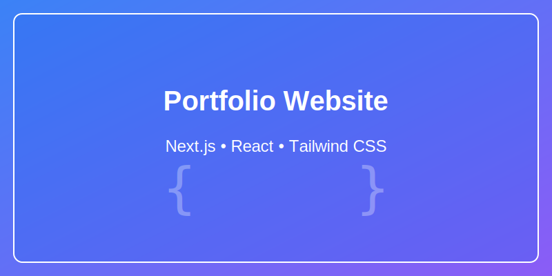

# Portfolio Website

A modern, responsive portfolio website built with Next.js, React, and Tailwind CSS to showcase my software development skills and projects.



## Live Demo

[View the live site](https://portfolio-website-drab-delta-15.vercel.app/)

## Features

- 🌐 **Multilingual Support** - Available in English, French, Spanish, and Haitian Creole
- 🌙 **Dark/Light Mode** - Automatic theme detection with system preferences
- 📱 **Responsive Design** - Optimized for all device sizes
- ⚡ **Performance Optimized** - Fast loading and smooth animations
- 📊 **Interactive Components** - Engaging user experience with Framer Motion animations
- 📧 **Contact Form** - Integrated email functionality
- 🔍 **SEO Friendly** - Optimized metadata for each page
- 📈 **Analytics** - Google Analytics integration for visitor tracking

## Tech Stack

- **Framework**: [Next.js](https://nextjs.org/)
- **Frontend Library**: [React](https://reactjs.org/)
- **Styling**: [Tailwind CSS](https://tailwindcss.com/)
- **Animations**: [Framer Motion](https://www.framer.com/motion/)
- **State Management**: React Context API
- **Internationalization**: Custom i18n implementation with React Context
- **Email Service**: Resend API for contact form
- **Analytics**: Google Analytics
- **Deployment**: [Vercel](https://vercel.com/)
- **Performance Testing**: Lighthouse

## Project Structure
portfolio-website/
├── public/               # Static assets
│   ├── images/           # Image assets
│   │   └── projects/     # Project screenshots
│   └── resumes/          # Resume PDFs
├── src/
│   ├── app/              # Next.js App Router
│   │   ├── api/          # API routes
│   │   │   └── contact/  # Contact form API
│   │   ├── about/        # About page
│   │   ├── contact/      # Contact page
│   │   ├── projects/     # Projects directory
│   │   │   ├── backend-assignment/
│   │   │   ├── elderly-care-management/
│   │   │   ├── frontend-assignment/
│   │   │   └── portfolio-website/
│   │   └── page.tsx      # Home page
│   ├── components/       # Reusable components
│   │   ├── Footer.tsx
│   │   ├── GoogleAnalytics.tsx
│   │   ├── Hero.tsx
│   │   ├── LanguageSelector.tsx
│   │   ├── Navbar.tsx
│   │   ├── ProjectCard.tsx
│   │   ├── SafeMotion.tsx
│   │   ├── Skills.tsx
│   │   └── ThemeToggle.tsx
│   ├── i18n/             # Internationalization
│   │   ├── locales/      # Translation files
│   │   │   ├── en.ts     # English translations
│   │   │   ├── fr.ts     # French translations
│   │   │   ├── es.ts     # Spanish translations
│   │   │   └── ht.ts     # Haitian Creole translations
│   │   ├── index.ts      # i18n exports
│   │   └── LanguageContext.tsx # i18n context provider
├── next.config.ts        # Next.js configuration
├── tailwind.config.js    # Tailwind CSS configuration
├── lighthouse-check.js   # Lighthouse performance testing
└── tsconfig.json         # TypeScript configuration

## Getting Started

### Prerequisites

- Node.js (v18.17.0 or later)
- npm or yarn

### Installation

1. Clone the repository
   ```bash
   git clone https://github.com/KsaintJ/portfolio-website.git
   cd portfolio-website

Install dependencies
bashnpm install
# or
yarn install

Setup environment variables
Create a .env.local file in the root directory with the following variables:
RESEND_API_KEY=your_resend_api_key
NEXT_PUBLIC_GA_MEASUREMENT_ID=your_google_analytics_id

Run the development server
bashnpm run dev
# or
yarn dev

Open http://localhost:3000 in your browser to see the result.

Key Components
Internationalization (i18n)
The website implements a custom i18n system using React Context API:

LanguageContext.tsx - Provides language state and translation functions
Language Files - Structured JSON objects for each supported language
LanguageSelector - UI component for switching languages
LocalStorage - Persists language preference across sessions

The system supports:

English (default)
French
Spanish
Haitian Creole

SafeMotion Component
A custom wrapper around Framer Motion to prevent hydration mismatches:
typescript// Example usage
<SafeMotion>
  <motion.div
    initial={{ opacity: 0, y: 20 }}
    animate={{ opacity: 1, y: 0 }}
    transition={{ duration: 0.5 }}
  >
    Content
  </motion.div>
</SafeMotion>
Google Analytics
The site includes Google Analytics tracking through a custom component that safely loads the GA script:
typescript// GoogleAnalytics.tsx
'use client';

import Script from 'next/script';
import { usePathname, useSearchParams } from 'next/navigation';
import { useEffect } from 'react';

// Usage in layout.tsx
export default function Layout({ children }) {
  return (
    <html lang="en">
      <body>
        {children}
        <GoogleAnalytics />
      </body>
    </html>
  )
}
Performance Optimization
The website includes several performance optimizations:

Image Optimization - Using Next.js Image component with proper sizing
Code Splitting - Automatic code splitting with Next.js
Client-Side Rendering Controls - SafeClientOnly and SafeMotion components
Lighthouse Testing - Regular performance audits with Lighthouse

Deployment
The project is set up for easy deployment on Vercel:

Push your code to GitHub
Import the project in Vercel
Set the environment variables
Deploy

Domain Recommendations
For a professional online presence, consider these domain options:

kendersaintjuste.dev - Professional, uses full name with developer TLD
kender.dev - Short, memorable, and modern
ksaintj.dev - Matches GitHub username for consistency

The .dev TLD clearly signals your identity as a developer while establishing your personal brand.
Adding New Projects
To add a new project to the portfolio:

Create a new directory in src/app/projects/[project-name]
Add a page.tsx file with the project details
Create a metadata file for SEO optimization
Add project images to public/images/projects/[project-name]/
Update translation files with project information

License
This project is MIT licensed.
Contact
Kender Saint-Juste - ksaintjuste7@gmail.com
Project Link: https://github.com/KsaintJ/portfolio-website
Acknowledgements

Next.js
Tailwind CSS
Framer Motion
React Icons
Vercel
Resend
